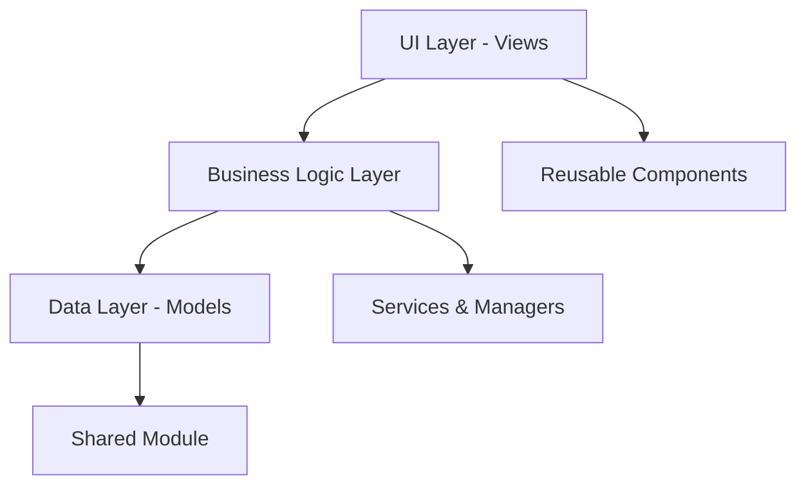

# NutritionTracker Refactor Plan

## Overview
This document outlines a comprehensive refactor plan to improve the project structure, organization, and maintainability of the NutritionTracker app without changing UI or functionality.

## Current Architecture Issues

### Identified Problems:
1. **Flat File Structure**: All 16+ Swift files are in one directory making them hard to find
2. **Code Duplication**: [`FoodItem.swift`](NutritionTracker/NutritionTracker/NutritionTracker/FoodItem.swift), [`CalorieGoal.swift`](NutritionTracker/NutritionTracker/NutritionTracker/CalorieGoal.swift), and [`FoodHistory.swift`](NutritionTracker/NutritionTracker/NutritionTracker/FoodHistory.swift) are duplicated between main app and widget
3. **Mixed Concerns**: Views contain business logic, data models, and UI components
4. **Large View Files**: [`WeeklyPlannerView.swift`](NutritionTracker/NutritionTracker/NutritionTracker/WeeklyPlannerView.swift) is 929 lines with multiple view structs
5. **No Clear Module Boundaries**: Everything is tightly coupled
6. **Deep Nesting**: Project path is unnecessarily deep (`NutritionTracker/NutritionTracker/NutritionTracker/`)

## Proposed New Architecture

### 1. Simplified Project Structure
```
NutritionTracker/
├── NutritionTracker/           # Main app target
├── NutritionWidget/            # Widget target  
├── Shared/                     # Shared code module
└── NutritionTracker.xcodeproj
```

### 2. Main App Organization (`NutritionTracker/`)
```
NutritionTracker/
├── App/
│   ├── NutritionTrackerApp.swift
│   ├── ContentView.swift
│   └── Info.plist
├── Features/
│   ├── DailyView/
│   │   ├── DailyView.swift
│   │   ├── DayView.swift
│   │   └── SwipeableDaysView.swift
│   ├── FoodManagement/
│   │   ├── AddFoodView.swift
│   │   ├── EditFoodView.swift
│   │   └── CopyToDaysView.swift
│   ├── WeeklyPlanner/
│   │   ├── WeeklyPlannerView.swift
│   │   ├── Components/
│   │   │   ├── WeekDayButton.swift
│   │   │   ├── MonthDayButton.swift
│   │   │   └── EnhancedCopyDaySheet.swift
│   │   └── Models/
│   │       └── ViewMode.swift
│   └── Settings/
│       └── SettingsView.swift
├── Components/
│   ├── FoodItemCard.swift
│   └── Buttons/
│       ├── PrimaryButton.swift
│       └── SecondaryButton.swift
├── Resources/
│   ├── Assets.xcassets/
│   └── Theme.swift
└── NutritionTracker.entitlements
```

### 3. Shared Module (`Shared/`)
```
Shared/
├── Models/
│   ├── FoodItem.swift
│   ├── CalorieGoal.swift
│   ├── FoodHistory.swift
│   └── Item.swift          # Remove if unused
├── Extensions/
│   └── FoodItem+Extensions.swift
└── Services/
    └── CalorieCalculationService.swift
```

### 4. Widget Organization (`NutritionWidget/`)
```
NutritionWidget/
├── Views/
│   ├── NutritionWidget.swift
│   ├── SmallWidgetView.swift
│   ├── MediumWidgetView.swift
│   ├── LargeWidgetView.swift
│   └── ExtraLargeWidgetView.swift
├── Intents/
│   └── AppIntent.swift
├── Extensions/
│   ├── NutritionWidgetBundle.swift
│   ├── NutritionWidgetControl.swift
│   └── NutritionWidgetLiveActivity.swift
├── Resources/
│   ├── Assets.xcassets/
│   └── Info.plist
└── NutritionWidgetExtension.entitlements
```

## Shared Module Strategy

### Benefits:
1. **Eliminates Code Duplication**: Single source of truth for models
2. **Easier Maintenance**: Changes only need to be made in one place
3. **Consistent Data Models**: Ensures both app and widget use identical model definitions
4. **Better Testing**: Single test suite for shared components

### Implementation:
```swift
// Shared/Models/FoodItem.swift - Single source of truth
@Model
final class FoodItem {
    // Existing implementation moves here
}

// Shared/Extensions/FoodItem+Extensions.swift
extension FoodItem {
    static func todaysItems(in context: ModelContext) -> [FoodItem] {
        // Move utility methods here
    }
}
```

## Component Extraction Strategy

### Large File Breakdown
**WeeklyPlannerView.swift (929 lines) →**
```
WeeklyPlanner/
├── WeeklyPlannerView.swift     # Main view only (~200 lines)
├── Components/
│   ├── WeekDayButton.swift     # ~50 lines
│   ├── MonthDayButton.swift    # ~90 lines
│   ├── WeeklyFoodItemRow.swift # ~80 lines
│   └── EnhancedCopyDaySheet.swift # ~150 lines
└── Models/
    └── ViewMode.swift          # ~30 lines
```

## File Organization Strategy

### Naming Conventions:
- **Views**: End with `View` (e.g., `DailyView`, `AddFoodView`)
- **Components**: Descriptive names (e.g., `FoodItemCard`, `PrimaryButton`)
- **Models**: Noun names (e.g., `FoodItem`, `CalorieGoal`)
- **Extensions**: `ModelName+Purpose` (e.g., `FoodItem+Extensions`)

### Folder Organization Rules:
```
✅ Good: Features/DailyView/DailyView.swift
❌ Bad: Views/Daily/DailyView.swift

✅ Good: Components/Buttons/PrimaryButton.swift  
❌ Bad: UI/Button.swift

✅ Good: Shared/Models/FoodItem.swift
❌ Bad: Models/Shared/FoodItem.swift
```

## Modular Architecture with Clear Boundaries

### Layer Separation:


### Protocol-Based Design:
```swift
// Clear interface for data models
public protocol FoodItemProtocol {
    var name: String { get }
    var calories: Int { get }
    var status: FoodStatus { get set }
}

// Business logic services
public class CalorieCalculationService {
    public static func calculateDailyTotal(_ items: [FoodItem]) -> Int
    public static func calculateRemaining(eaten: Int, goal: Int) -> Int
}
```

### Dependency Injection:
```swift
// Clear dependencies between modules
struct DailyView: View {
    @StateObject private var manager: DailyViewManager
    
    init(dataService: FoodDataService = .shared) {
        self._manager = StateObject(wrappedValue: DailyViewManager(dataService: dataService))
    }
}
```

## Migration Strategy

### Phase-Based Approach:

#### **Phase 1: Project Structure Setup (Low Risk)**
1. Create new folder structure without moving existing files
2. Add new Shared framework target to Xcode project
3. Verify build still works with existing flat structure

#### **Phase 2: Extract Shared Components (Medium Risk)**
1. **Move data models to Shared module:**
   - `FoodItem.swift` → `Shared/Models/FoodItem.swift`
   - `CalorieGoal.swift` → `Shared/Models/CalorieGoal.swift`
   - `FoodHistory.swift` → `Shared/Models/FoodHistory.swift`

2. **Update imports in both targets:**
   ```swift
   // Before
   // No import needed
   
   // After  
   import Shared
   ```

3. Remove duplicate files from widget target
4. Test thoroughly - models are critical to app functionality

#### **Phase 3: Reorganize Views by Feature (Medium Risk)**
1. Create feature folders and move related views
2. Update file references in Xcode project
3. Test navigation and view loading

#### **Phase 4: Extract Reusable Components (Low Risk)**
1. Break down large files like `WeeklyPlannerView.swift`
2. Extract view components to separate files
3. Move to Components/ folders

#### **Phase 5: Refactor Business Logic (High Risk)**
1. Extract view managers and services
2. Implement protocol-based design
3. Add dependency injection

### Risk Mitigation:
- **Git commits after each phase** for easy rollback
- **Comprehensive testing** between phases
- **Keep existing file structure** until new structure is verified
- **Gradual migration** - don't move everything at once

## Architecture Patterns and Conventions

### File Naming Conventions:
```swift
// Views: Always end with "View"
DailyView.swift
AddFoodView.swift
WeeklyPlannerView.swift

// Components: Descriptive, reusable parts
FoodItemCard.swift
PrimaryButton.swift
CalendarDayButton.swift

// Models: Noun-based, represent data
FoodItem.swift
CalorieGoal.swift
FoodHistory.swift

// Extensions: ModelName+Purpose
FoodItem+Extensions.swift
Date+Helpers.swift

// Managers/Services: Action-based
FoodDataService.swift
CalorieCalculationService.swift
```

### Code Organization Pattern:
```swift
struct DailyView: View {
    // MARK: - Properties
    @Environment(\.modelContext) private var modelContext
    @State private var selectedDate = Date()
    
    // MARK: - Computed Properties
    private var todaysItems: [FoodItem] { ... }
    
    // MARK: - Body
    var body: some View { ... }
    
    // MARK: - Private Methods
    private func loadItems() { ... }
}
```

### Import Organization:
```swift
// System frameworks first
import SwiftUI
import SwiftData
import WidgetKit

// Project modules
import Shared

// Third-party (if any)
```

## Before vs After Comparison

### **BEFORE: Current Structure Issues**

```
NutritionTracker/NutritionTracker/NutritionTracker/
├── 16+ Swift files in flat structure ❌
├── Code duplication between app and widget ❌
├── Large files (WeeklyPlannerView.swift: 929 lines) ❌
├── Mixed concerns (views + business logic + data) ❌
└── Hard to find specific functionality ❌
```

### **AFTER: Clean Architecture**

```
NutritionTracker/
├── NutritionTracker/                    # Main App Target
│   ├── Features/                        # ✅ Feature-based organization
│   ├── Components/                      # ✅ Reusable UI components
│   └── Resources/
├── NutritionWidget/                     # Widget Target
│   ├── Views/                          # ✅ Clear widget organization
│   ├── Intents/
│   └── Extensions/
├── Shared/                             # ✅ Eliminates code duplication
│   ├── Models/
│   ├── Extensions/
│   └── Services/
└── NutritionTracker.xcodeproj
```

## Key Benefits Summary

| Issue | Before | After | Impact |
|-------|--------|-------|---------|
| **Discoverability** | All files in flat structure | Feature-based folders | ⭐⭐⭐ High |
| **Code Duplication** | 3 files duplicated | Shared module | ⭐⭐⭐ High |
| **File Size** | 929-line WeeklyPlannerView | Broken into components | ⭐⭐ Medium |
| **Maintainability** | Mixed concerns | Clear separation | ⭐⭐⭐ High |
| **Testing** | Tightly coupled | Protocol-based design | ⭐⭐ Medium |

## Expected Outcomes

1. **🔍 Better Discoverability**: Navigate to `Features/DailyView/` to find daily tracking code
2. **🔄 No More Duplication**: Single source of truth for models in `Shared/`
3. **📏 Smaller Files**: Extract components from large files
4. **🔗 Loose Coupling**: Clear boundaries between features
5. **🧪 Better Testing**: Protocol-based design enables mocking
6. **⚡ Performance**: Modular loading and better build times

---

## Next Steps

To implement this refactor plan:

1. Review and approve this architectural plan
2. Switch to Code mode to begin implementation
3. Follow the phase-based migration strategy
4. Test thoroughly after each phase
5. Document any deviations or additional improvements discovered during implementation