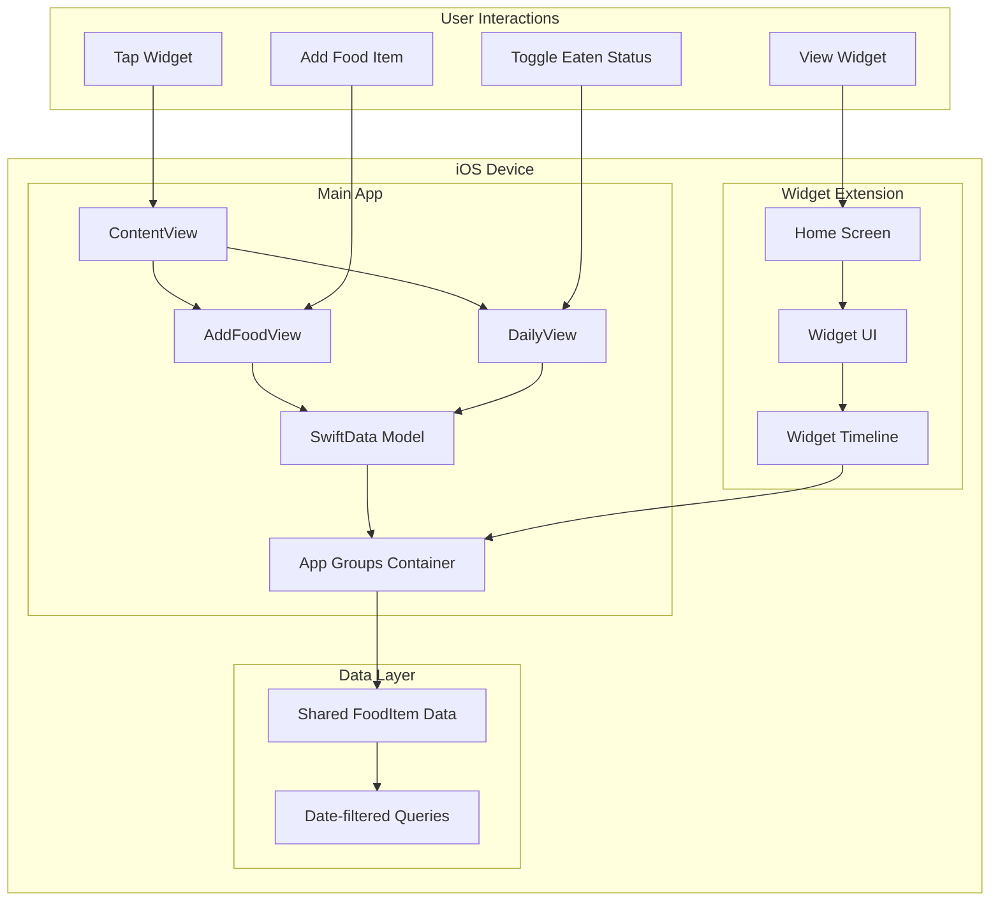
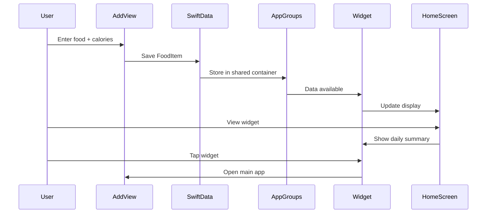

# System Architecture - Nutrition Tracker App

## Component Overview



## Data Flow Architecture



## Technical Component Details

### SwiftData Model Structure
```swift
@Model
final class FoodItem {
    var id: UUID = UUID()
    var name: String = ""
    var calories: Int = 0
    var date: Date = Date()
    var status: FoodStatus = .planned
    var createdAt: Date = Date()
    
    enum FoodStatus: String, CaseIterable, Codable {
        case planned = "planned"
        case eaten = "eaten"
    }
}
```

### Widget Timeline Strategy
- **Static Timeline**: Updates every 15 minutes
- **Dynamic Updates**: When app makes changes
- **Fallback**: Show cached data if unavailable

### App Groups Integration
- **Shared Container**: `group.com.yourname.nutritiontracker`
- **Data Access**: Both app and widget can read/write
- **Synchronization**: SwiftData handles concurrent access

## Performance Optimizations

### Data Queries
- Filter by date range (today only)
- Limit widget data (max 4 items)
- Cache calculations in memory

### Widget Updates
- Batch updates to minimize battery impact
- Use relevant timeline entries
- Smart refresh based on user activity

### Memory Management
- SwiftData lazy loading
- Widget memory constraints (<30MB)
- Efficient date comparisons

## Error Handling Strategy

### Data Persistence
- Graceful fallbacks if SwiftData unavailable
- Validation before saving items
- Recovery from corrupted data

### Widget Reliability
- Show placeholder if no data
- Handle App Groups permission issues
- Maintain functionality if main app deleted

## Security & Privacy

### Local Data Only
- No network requests
- No user accounts
- Data stays on device

### App Groups Security
- Sandboxed shared container
- iOS-managed permissions
- No cross-app data leaks

---

This architecture ensures a robust, performant, and maintainable nutrition tracking app that works reliably across both the main app and widget contexts.